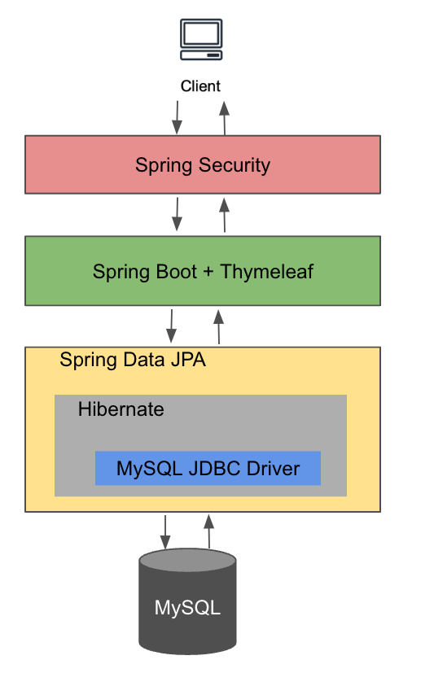
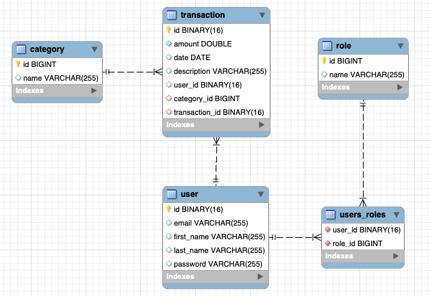

# Expense Tracker

A comprehensive tool for managing your personal finances. This project allows users to track their expenses, providing a clear overview of their financial health.

## Features
- **Create Account:** Store each user's expeneses
- **Add Expenses:** Quickly log expenses across various categories.
- **Analytics:** Visualize your financial activities with easy-to-understand graphs and charts.
- **Category Management:** Customize categories to fit your financial planning needs.

## Technologies Used
- High level infrastructure diagram



- Database Entity Relationship Diagram (ERD)


## Getting Started

Clone the repository to get the Expense Tracker running on your local machine.

```bash
git clone https://github.com/trevor-tran/expense-tracker.git
cd expense-tracker